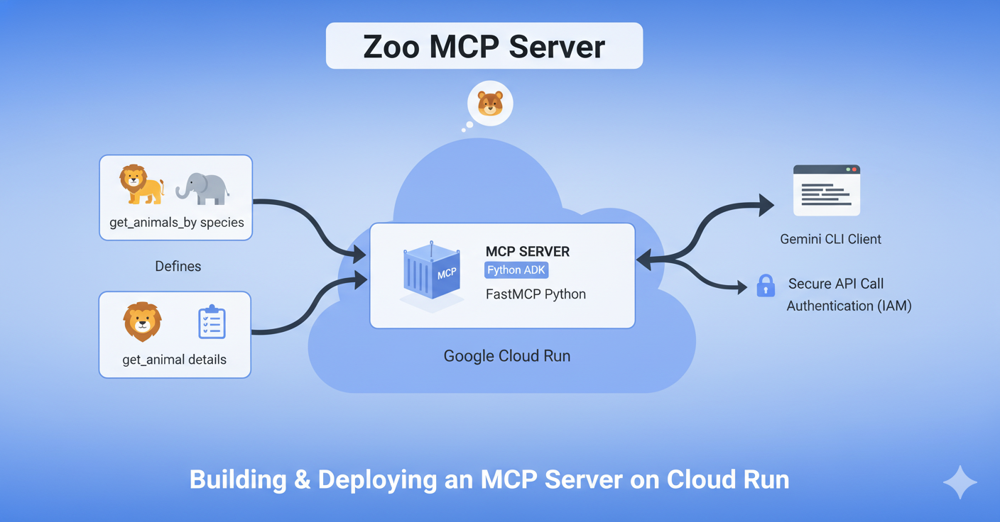

# How to Deploy a Secure Safaricom M-PESA Express MCP Server on Cloud Run

## Introduction

### Overview

In this lab, you will build and deploy a Model Context Protocol (MCP) server on Cloud Run. The server will expose two categories of tools:

- **catalog tools** backed by a static product JSON file
- **payments tools** backed by MPESA Express / STK Push logic

This keeps the workshop architecture simple while still showing a realistic product-to-payment flow from catalog lookup to MPESA Express initiation.

### What You'll Do

We will use [FastMCP](https://github.com/PrefectHQ/FastMCP) to create a single MCP server with tools such as:

- `list_products` — list products from a static merchant catalog
- `get_product` — fetch a specific product by ID
- `calculate_order_total` — compute a basket total from line items
- `generate_access_token_request` — generate a DARAJA OAuth access token
- `validate_stk_push_payload` — validate a payment request before submission
- `initiate_stk_push` — construct and send an MPESA Express request
- `parse_stk_callback` — interpret the callback payload
- `explain_stk_error` — translate error codes into actionable guidance

FastMCP provides a quick, Pythonic way to build MCP servers and clients.

### What You'll Learn

- Deploy the MCP server to Cloud Run
- Secure the server endpoint by requiring authentication for all requests
- Expose both product and payment capabilities through one MCP surface
- Connect to your secure MCP server endpoint from Gemini CLI
