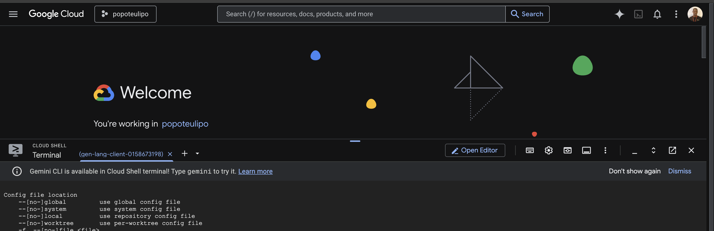

# Open Cloud Shell Editor

In this step, you will open Cloud Shell Editor, make sure the terminal is available, verify the active account and project, and set the correct Google Cloud project for the rest of the lab.

## Launch Cloud Shell Editor



Cloud Shell Editor is a browser-based development environment that includes Cloud Shell, a terminal, and preinstalled Google Cloud developer tools.

1. In the Google Cloud Console, click **Activate Cloud Shell** in the top-right toolbar.
2. When prompted, click **Continue**.
3. If you are asked to authorize Cloud Shell at any point, click **Authorize** to continue.
4. Wait for the environment to finish starting.

## Open the Terminal

If the terminal does not appear automatically at the bottom of the screen:

1. Click **View**
2. Click **Terminal**
3. Click **Open New Terminal**

## Verify Your Account and Project

Before proceeding, ensure you're using the correct Google account and project.

### Check Current Authenticated Accounts

```bash
gcloud auth list
```

You should see output similar to:

```
Credentialed Accounts

ACTIVE: *
ACCOUNT: your-email@gmail.com
```

### Check Current Project

```bash
gcloud config get-value project
```

### List Available Projects

```bash
gcloud projects list
```

## Set Your Project

In the terminal, set your project with this command:

```bash
gcloud config set project YOUR_PROJECT_ID
```

Example:

```bash
gcloud config set project lab-project-id-example
```

If you cannot remember your project ID, you can list project IDs with:

```bash
gcloud projects list | awk '/PROJECT_ID/{print $2}'
```

You should see output similar to:

```bash
Updated property [core/project].
```

If you see a warning and are asked:

```bash
Do you want to continue (Y/n)?
```

then the project ID is likely incorrect. Press `n`, press Enter, and run the command again with the correct project ID.

To verify the active project after setting it, run:

```bash
gcloud config get-value project
```

## Switch Accounts (If Needed)

If the wrong Google account is active in Cloud Shell, switch it before continuing.

### Login with the Correct Account

```bash
gcloud auth login your-email@gmail.com
```

A browser window will open so you can sign in and allow access.

### Set the Active Account

```bash
gcloud config set account your-email@gmail.com
```

### Confirm the Active Account

```bash
gcloud auth list
```

Your preferred account should be marked with an asterisk (`*`).
