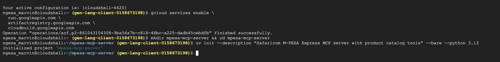
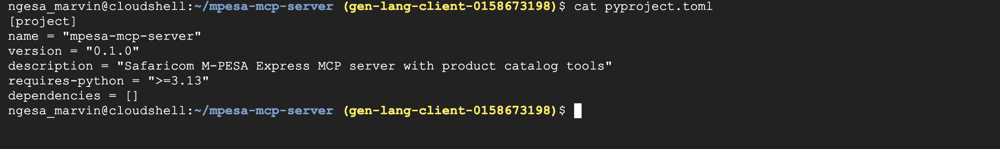

# Prepare Your Python Project

## Create the Project Folder

Create a folder named `mpesa-mcp-server` to store the source code for deployment:

```bash
mkdir mpesa-mcp-server && cd mpesa-mcp-server
```

## Initialize the Python Project

Create a Python project with the `uv` tool to generate a `pyproject.toml` file:

```bash
uv init --description "Safaricom M-PESA Express MCP server with product catalog tools" --bare --python 3.13
```

You should see:

```text
Initialized project `mpesa-mcp-server`
```



## Verify the Project Configuration

The `uv init` command creates a `pyproject.toml` file for your project. To view the contents of the file, run:

```bash
cat pyproject.toml
```

The output should look like the following:

```toml
[project]
name = "mpesa-mcp-server"
version = "0.1.0"
description = "Safaricom M-PESA Express MCP server with product catalog tools"
requires-python = ">=3.13"
dependencies = []
```

