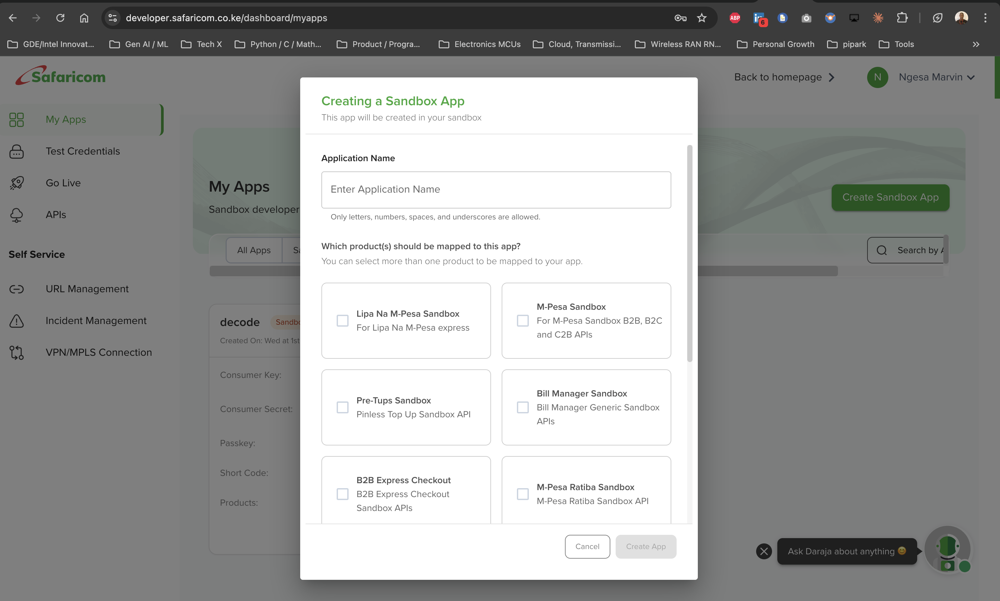
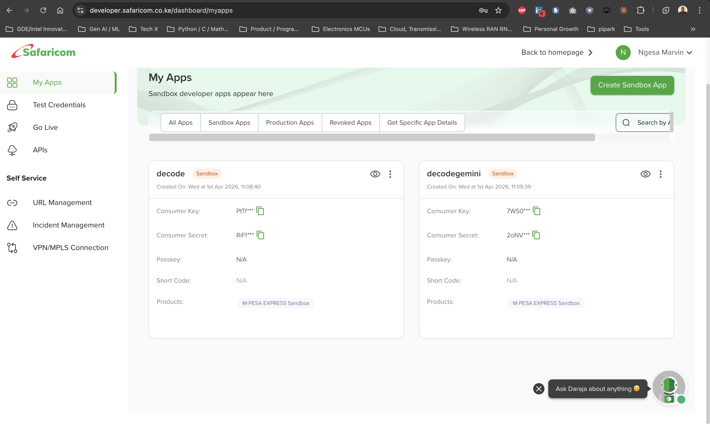
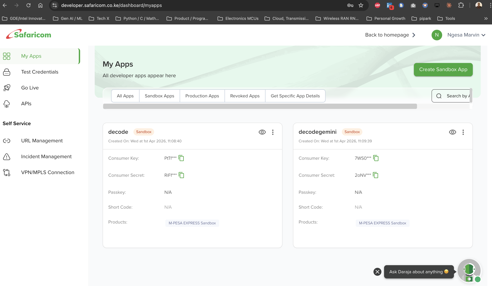

# Build the MPESA Express MCP Server with FastMCP

In this step, you will build an MCP server that exposes both a **merchant product catalog** and **Safaricom M-PESA Express** capabilities as structured tools for developers, Gemini CLI, and Google ADK agents.

Instead of calling raw APIs directly every time, the MCP server provides a reusable tool layer for:

- listing products from a static catalog
- fetching product details
- calculating order totals
- generating access tokens
- validating MPESA Express request payloads
- initiating STK Push requests
- interpreting callback payloads
- explaining common API and transaction errors

This is a much better fit for agentic systems than a toy in-memory example because **MPESA Express is asynchronous by design**:

1. The merchant system sends a request
2. Safaricom acknowledges the request
3. The customer receives an STK Push prompt on their phone
4. The customer enters their M-PESA PIN
5. Safaricom sends the final result to the merchant callback URL

In production, this pattern can sit behind **Apigee** to add policy enforcement, quotas, spike arrest, observability, and governed API exposure.

## Why One MCP Server

For this workshop, we are intentionally using **one MCP server** instead of splitting into separate catalog and payments MCP services.

That design keeps the workshop simpler while still preserving a clean separation inside the code:

- `catalog` tools for product data
- `payments` tools for MPESA Express

The ADK agent in Lab 2 will then orchestrate both domains through a single `MCPToolset`.

## Product Catalog Model

The merchant catalog is static JSON for workshop simplicity. Each product contains:

- `id`
- `name`
- `category`
- `price_kes`
- `currency`
- `inventory_status`

This gives the agent enough context to:

- search products
- retrieve prices
- build an order
- pass the total into an MPESA Express request

## What We Are Wrapping

For this lab, the MCP server is modeling the **LIPA NA M-PESA ONLINE API**, also known as **M-PESA Express / STK Push**.

## Safaricom Sandbox Values for This Lab

Use the following **STK Push-relevant** sandbox values in the examples and prompts for this workshop:

- `BusinessShortCode`: `174379`
- `PhoneNumber`: `254708374149`
- `PartyA`: `254708374149`
- `PartyB`: `174379`
- `Passkey`: `bfb279f9aa9bdbcf158e97dd71a467cd2e0c893059b10f78e6b72ada1ed2c919`

Important boundary:

- `Initiator Name`: `testapi`
- `Initiator Password`: `Safaricom123!!`
- `Party A`: `600992`
- `Party B`: `600000`

These values are **not used by the STK Push flow implemented in this lab**. They are associated with other Safaricom API patterns and should not replace the phone-number and shortcode values used for MPESA Express payload validation in this workshop.

Core request concepts:

- `BusinessShortCode`
- `Password`
- `Timestamp`
- `TransactionType`
- `Amount`
- `PartyA`
- `PartyB`
- `PhoneNumber`
- `CallBackURL`
- `AccountReference`
- `TransactionDesc`

Core response concepts:

- `MerchantRequestID`
- `CheckoutRequestID`
- `ResponseCode`
- `ResponseDescription`
- `CustomerMessage`

Core callback concepts:

- `ResultCode`
- `ResultDesc`
- `CallbackMetadata`

## Add FastMCP and HTTP Client Dependencies

Run the following command to add FastMCP and `httpx` as dependencies in the `pyproject.toml` file:

```bash
uv add fastmcp==2.12.4 httpx==0.28.1 --no-sync
```

You should see output similar to:

```text
Using CPython 3.13.2
Resolved 65 packages in 933ms
```

This will also add `httpx` to your dependencies and create a `uv.lock` file for the project.

## Create the Server File

Create and open a new `server.py` file for the MCP server source code:

```bash
cloudshell edit ~/mpesa-mcp-server/server.py
```

The `cloudshell edit` command will open the `server.py` file in the editor above the terminal.

If the command fails with an error like:

```text
Exception: Cannot send messages to client. Please try again later
```

your Cloud Shell terminal is running, but the browser editor client is not ready to receive the request. Use this fallback:

1. Create the file manually:

   ```bash
   touch ~/mpesa-mcp-server/server.py
   ```

2. Open the `mpesa-mcp-server` folder from the Cloud Shell Editor file explorer.
3. Click `server.py` in the editor.
4. Paste the server code from this step and save the file.

To confirm the project files are in place, run:

```bash
ls ~/mpesa-mcp-server
```

You should see:

```text
pyproject.toml
server.py
uv.lock
```










## Add the Server Code

Add the following MPESA Express MCP server source code in the `server.py` file:

```python
import asyncio
import base64
import logging
import os
from datetime import datetime, timezone
from typing import Any, Dict

from fastmcp import FastMCP
import httpx

logger = logging.getLogger(__name__)
logging.basicConfig(format="[%(levelname)s]: %(message)s", level=logging.INFO)

mcp = FastMCP("MPESA Express MCP Server")

SANDBOX_BASE_URL = "https://sandbox.safaricom.co.ke"
TOKEN_PATH = "/oauth/v1/generate?grant_type=client_credentials"
STK_PUSH_PATH = "/mpesa/stkpush/v1/processrequest"
DEFAULT_TIMEOUT_SECONDS = 30.0

PRODUCTS = [
    {
        "id": "conf-pass-001",
        "name": "Build With AI Conference Pass",
        "category": "event",
        "price_kes": 5,
        "currency": "KES",
        "inventory_status": "in_stock",
    },
    {
        "id": "tee-001",
        "name": "DECODE Workshop T-Shirt",
        "category": "merch",
        "price_kes": 3,
        "currency": "KES",
        "inventory_status": "in_stock",
    },
    {
        "id": "coffee-001",
        "name": "Single Origin Coffee Beans",
        "category": "retail",
        "price_kes": 1,
        "currency": "KES",
        "inventory_status": "low_stock",
    },
]


def current_timestamp() -> str:
    return datetime.now(timezone.utc).strftime("%Y%m%d%H%M%S")


def build_password(shortcode: str, passkey: str, timestamp: str) -> str:
    raw_value = f"{shortcode}{passkey}{timestamp}".encode("utf-8")
    return base64.b64encode(raw_value).decode("utf-8")


def get_env_value(*names: str) -> str:
    for name in names:
        value = os.getenv(name)
        if value:
            return value
    raise ValueError(f"Missing required environment variable. Expected one of: {', '.join(names)}")


def get_http_timeout() -> float:
    return float(os.getenv("MPESA_HTTP_TIMEOUT_SECONDS", DEFAULT_TIMEOUT_SECONDS))


@mcp.tool()
def list_products() -> Dict[str, Any]:
    """Returns the full static merchant product catalog."""
    logger.info(">>> Tool called: list_products")
    return {"products": PRODUCTS}


@mcp.tool()
def get_product(product_id: str) -> Dict[str, Any]:
    """Returns a specific product by product_id."""
    logger.info(">>> Tool called: get_product")
    for product in PRODUCTS:
        if product["id"] == product_id:
            return product
    return {"error": f"Product '{product_id}' not found"}


@mcp.tool()
def calculate_order_total(items: list[dict[str, Any]]) -> Dict[str, Any]:
    """
    Calculates an order total from product IDs and quantities.

    Example items:
    [{"product_id": "conf-pass-001", "quantity": 2}]
    """
    logger.info(">>> Tool called: calculate_order_total")

    lines = []
    total = 0
    for item in items:
        product = next((p for p in PRODUCTS if p["id"] == item["product_id"]), None)
        if not product:
            return {"error": f"Product '{item['product_id']}' not found"}
        quantity = int(item["quantity"])
        line_total = product["price_kes"] * quantity
        total += line_total
        lines.append(
            {
                "product_id": product["id"],
                "name": product["name"],
                "quantity": quantity,
                "unit_price_kes": product["price_kes"],
                "line_total_kes": line_total,
            }
        )

    return {
        "currency": "KES",
        "line_items": lines,
        "order_total_kes": total,
    }


@mcp.tool()
def generate_access_token_request() -> Dict[str, Any]:
    """
    Generates a DARAJA access token using environment-provided consumer credentials.
    """
    logger.info(">>> Tool called: generate_access_token_request")

    try:
        consumer_key = get_env_value("MPESA_CONSUMER_KEY", "CONSUMER_KEY")
        consumer_secret = get_env_value("MPESA_CONSUMER_SECRET", "CONSUMER_SECRET")
    except ValueError as exc:
        logger.error("Missing credentials: %s", exc)
        return {"error": str(exc)}

    token_url = f"{SANDBOX_BASE_URL}{TOKEN_PATH}"

    try:
        response = httpx.get(
            token_url,
            auth=(consumer_key, consumer_secret),
            timeout=get_http_timeout(),
        )
        response.raise_for_status()
        token_payload = response.json()
    except httpx.TimeoutException:
        logger.error("Token request timed out")
        return {"error": "Token request timed out. Safaricom sandbox may be slow — retry."}
    except httpx.HTTPStatusError as exc:
        logger.error("Token request failed: %s %s", exc.response.status_code, exc.response.text)
        return {"error": f"Token request failed with HTTP {exc.response.status_code}: {exc.response.text}"}
    except httpx.HTTPError as exc:
        logger.error("Token request error: %s", exc)
        return {"error": f"Token request network error: {exc}"}

    return {
        "environment": "sandbox",
        "token_url": token_url,
        "auth_mode": "basic_auth",
        "access_token": token_payload["access_token"],
        "expires_in": token_payload.get("expires_in"),
        "next_step": "Use the generated token as a Bearer token for MPESA Express requests.",
    }


@mcp.tool()
def validate_stk_push_payload(
    business_shortcode: str,
    transaction_type: str,
    amount: int,
    party_a: str,
    party_b: str,
    phone_number: str,
    callback_url: str,
    account_reference: str,
    transaction_desc: str,
) -> Dict[str, Any]:
    """
    Performs basic validation for an MPESA Express request before it is sent.

    Sandbox defaults (use these unless the user specifies otherwise):
    - business_shortcode: "174379"
    - party_b: "174379"
    - transaction_type: "CustomerPayBillOnline"
    - callback_url: "https://webhook.site/75b593ff-ae70-45a0-a569-3efe2ff58b59"
    - account_reference: "DECODE2026"
    - transaction_desc: "decode pay"

    The agent MUST ask the user for their phone_number (format 2547XXXXXXXX).
    party_a should be set to the same value as phone_number.
    amount should come from the product catalog via calculate_order_total.
    """
    logger.info(">>> Tool called: validate_stk_push_payload")

    errors = []

    if transaction_type not in {"CustomerPayBillOnline", "CustomerBuyGoodsOnline"}:
        errors.append("transaction_type must be CustomerPayBillOnline or CustomerBuyGoodsOnline")
    if amount < 1:
        errors.append("amount must be at least 1")
    if not party_a.startswith("2547") or len(party_a) != 12:
        errors.append("party_a must be in the format 2547XXXXXXXX")
    if not phone_number.startswith("2547") or len(phone_number) != 12:
        errors.append("phone_number must be in the format 2547XXXXXXXX")
    if len(account_reference) > 12:
        errors.append("account_reference must be 12 characters or fewer")
    if len(transaction_desc) > 13:
        errors.append("transaction_desc must be 13 characters or fewer")
    if not callback_url.startswith("https://"):
        errors.append("callback_url should use https")

    return {
        "valid": len(errors) == 0,
        "errors": errors,
        "normalized_payload": {
            "BusinessShortCode": business_shortcode,
            "TransactionType": transaction_type,
            "Amount": str(amount),
            "PartyA": party_a,
            "PartyB": party_b,
            "PhoneNumber": phone_number,
            "CallBackURL": callback_url,
            "AccountReference": account_reference,
            "TransactionDesc": transaction_desc,
        },
    }


@mcp.tool()
def initiate_stk_push(
    business_shortcode: str,
    passkey: str,
    transaction_type: str,
    amount: int,
    party_a: str,
    party_b: str,
    phone_number: str,
    callback_url: str,
    account_reference: str,
    transaction_desc: str,
) -> Dict[str, Any]:
    """
    Calls the live Safaricom sandbox MPESA Express endpoint and returns the API response.

    Sandbox defaults (use these unless the user specifies otherwise):
    - business_shortcode: "174379"
    - passkey: "bfb279f9aa9bdbcf158e97dd71a467cd2e0c893059b10f78e6b72ada1ed2c919"
    - party_b: "174379"
    - transaction_type: "CustomerPayBillOnline"
    - callback_url: "https://webhook.site/75b593ff-ae70-45a0-a569-3efe2ff58b59"
    - account_reference: "DECODE2026"
    - transaction_desc: "decode pay"

    The agent MUST ask the user for their phone_number (format 2547XXXXXXXX).
    party_a should be set to the same value as phone_number.
    amount should come from the product catalog via calculate_order_total.
    """
    logger.info(">>> Tool called: initiate_stk_push")

    validation = validate_stk_push_payload(
        business_shortcode=business_shortcode,
        transaction_type=transaction_type,
        amount=amount,
        party_a=party_a,
        party_b=party_b,
        phone_number=phone_number,
        callback_url=callback_url,
        account_reference=account_reference,
        transaction_desc=transaction_desc,
    )
    if not validation["valid"]:
        return validation

    timestamp = current_timestamp()
    password = build_password(business_shortcode, passkey, timestamp)
    token_info = generate_access_token_request()

    if "error" in token_info:
        return {"error": f"Could not get access token: {token_info['error']}"}

    access_token = token_info["access_token"]

    request_body = {
        "BusinessShortCode": business_shortcode,
        "Password": password,
        "Timestamp": timestamp,
        "TransactionType": transaction_type,
        "Amount": str(amount),
        "PartyA": party_a,
        "PartyB": party_b,
        "PhoneNumber": phone_number,
        "CallBackURL": callback_url,
        "AccountReference": account_reference,
        "TransactionDesc": transaction_desc,
    }

    try:
        response = httpx.post(
            f"{SANDBOX_BASE_URL}{STK_PUSH_PATH}",
            headers={
                "Authorization": f"Bearer {access_token}",
                "Content-Type": "application/json",
            },
            json=request_body,
            timeout=get_http_timeout(),
        )
        response.raise_for_status()
        response_payload = response.json()
    except httpx.TimeoutException:
        logger.error("STK Push request timed out")
        return {"error": "STK Push request timed out. Safaricom sandbox may be slow — retry."}
    except httpx.HTTPStatusError as exc:
        logger.error("STK Push failed: %s %s", exc.response.status_code, exc.response.text)
        return {"error": f"STK Push failed with HTTP {exc.response.status_code}: {exc.response.text}"}
    except httpx.HTTPError as exc:
        logger.error("STK Push network error: %s", exc)
        return {"error": f"STK Push network error: {exc}"}

    return {
        "environment": "sandbox",
        "endpoint": f"{SANDBOX_BASE_URL}{STK_PUSH_PATH}",
        "request_body": request_body,
        "response": response_payload,
        "accepted_for_processing": response_payload.get("ResponseCode") == "0",
        "checkout_request_id": response_payload.get("CheckoutRequestID"),
        "merchant_request_id": response_payload.get("MerchantRequestID"),
        "notes": [
            "This API is asynchronous.",
            "A ResponseCode of 0 means the request was accepted for processing.",
            "Final transaction outcome arrives on the callback URL.",
        ],
    }


@mcp.tool()
def parse_stk_callback(callback_payload: Dict[str, Any]) -> Dict[str, Any]:
    """
    Normalizes a Safaricom callback payload into a compact, agent-friendly structure.
    """
    logger.info(">>> Tool called: parse_stk_callback")

    stk_callback = callback_payload.get("Body", {}).get("stkCallback", {})
    metadata_items = stk_callback.get("CallbackMetadata", {}).get("Item", [])
    metadata = {item.get("Name"): item.get("Value") for item in metadata_items if "Name" in item}

    return {
        "merchant_request_id": stk_callback.get("MerchantRequestID"),
        "checkout_request_id": stk_callback.get("CheckoutRequestID"),
        "result_code": stk_callback.get("ResultCode"),
        "result_description": stk_callback.get("ResultDesc"),
        "successful": stk_callback.get("ResultCode") == 0,
        "amount": metadata.get("Amount"),
        "mpesa_receipt_number": metadata.get("MpesaReceiptNumber"),
        "transaction_date": metadata.get("TransactionDate"),
        "phone_number": metadata.get("PhoneNumber"),
    }


@mcp.tool()
def explain_stk_error(code: str) -> Dict[str, str]:
    """
    Maps common DARAJA and MPESA Express error codes to plain-language guidance.
    """
    logger.info(">>> Tool called: explain_stk_error")

    errors = {
        # Result codes (transaction outcome)
        "0": "Success. The transaction was processed successfully on M-PESA.",
        "1": "Insufficient balance. The customer does not have enough money in their M-PESA account.",
        "2": "Declined: amount is below the minimum C2B transaction limit (currently KES 1).",
        "3": "Declined: amount exceeds the maximum C2B transaction limit.",
        "4": "Declined: would exceed the customer's daily transfer limit (currently KES 500,000).",
        "8": "Declined: would exceed the Pay Bill or Till Number account balance limit.",
        "17": "Rule limited. Duplicate transaction — same amount to same customer within 2 minutes. Wait and retry.",
        "1019": "Transaction expired. The customer did not respond in time.",
        "1025": "Push request failed. The USSD prompt may be too long (over 182 chars). Shorten the AccountReference.",
        "1032": "Request cancelled by the customer.",
        "1037": "Customer unreachable. Phone may be offline, busy, or in another M-PESA session.",
        "2001": "Invalid M-PESA PIN entered by the customer. Advise them to retry with the correct PIN.",
        "2028": "Request not permitted. Check TransactionType and PartyB: use CustomerPayBillOnline for PayBill, CustomerBuyGoodsOnline for Till.",
        "8006": "Security credential locked. Customer should contact Safaricom Care (call 100 or 200).",
        "SFC_IC0003": "Operator does not exist. Verify TransactionType and PartyB match your short code type.",
        # API error codes (request-level)
        "400.002.02": "Invalid request payload. Check required fields, data types, and Content-Type: application/json header.",
        "404.001.01": "Resource not found. Verify you are calling the correct API endpoint.",
        "404.001.03": "Invalid access token. Generate a fresh token — tokens expire every hour.",
        "405.001": "Method not allowed. Ensure you are sending a POST request, not GET.",
        "500.001.1001": "Server error. Could be: merchant does not exist, wrong Password encoding, or subscriber locked in another session.",
        "500.003.02": "System busy or spike arrest violation. Retry with backoff and reduce request rate.",
        "500.003.03": "Quota violation. Too many requests — reduce your request volume.",
        "500.003.1001": "Internal server error. Verify your setup matches the API documentation.",
    }

    return {
        "code": code,
        "meaning": errors.get(code, "Unknown error code. Check the Safaricom DARAJA documentation."),
    }


if __name__ == "__main__":
    port = int(os.getenv("PORT", 8080))
    logger.info("🚀 MPESA Express MCP server started on port %s", port)
    asyncio.run(
        mcp.run_async(
            transport="http",
            host="0.0.0.0",
            port=port,
        )
    )
```

After saving the file, verify that `server.py` is no longer empty:

```bash
cat ~/mpesa-mcp-server/server.py
```

If the file prints the Python source code you just pasted, you are ready for the next step.

## Understanding the Code

The server defines eight MCP tools:

| Tool | Description |
|------|-------------|
| `list_products()` | Returns the full workshop product catalog |
| `get_product(product_id)` | Fetches one product and its price |
| `calculate_order_total(items)` | Totals a basket in KES |
| `generate_access_token_request()` | Generates a live DARAJA access token from environment-provided credentials |
| `validate_stk_push_payload(...)` | Checks required fields and normalizes the request payload |
| `initiate_stk_push(...)` | Validates the payload, fetches a token, and sends a real STK Push request |
| `parse_stk_callback(callback_payload)` | Converts callback payloads into a smaller, agent-friendly structure |
| `explain_stk_error(code)` | Explains common transaction and API errors with mitigation hints |

This structure is deliberate:

- **validation** is separate from **execution**
- **request submission** is separate from **callback interpretation**
- **error explanation** is separate from the raw API payload
- **credentials** stay in environment variables instead of source code

That separation makes the MCP tools easier for both humans and agents to use correctly.

## Why This Is Better Than a Raw REST Wrapper

The point of MCP is not to mirror every HTTP endpoint 1:1. The point is to expose the **useful capabilities** of a system as composable tools.

For this lab, the most useful capabilities are:

- listing products
- retrieving prices
- calculating an order total
- understanding what a valid request looks like
- constructing a correct STK Push payload
- interpreting asynchronous results
- explaining failures quickly

That is what the tools above are designed to do.

## Where Apigee Fits

You are building the MCP server on Cloud Run in this lab, but the production pattern should assume **Apigee** in front of the service for:

- quota enforcement
- spike arrest
- authentication and policy mediation
- observability
- partner-facing API productization

For the workshop, think of the architecture like this:

```text
Gemini CLI / ADK Agent
        |
        v
Apigee
        |
        v
Cloud Run MCP Server
        |
        +--> Static Product Catalog
        |
        v
Safaricom DARAJA APIs
```

## Sample MPESA Express Request

Here is a clean example of the request body your MCP server is helping to build after an order total has already been calculated:

```json
{
  "BusinessShortCode": "174379",
  "Password": "<base64_shortcode_passkey_timestamp>",
  "Timestamp": "20210628092408",
  "TransactionType": "CustomerPayBillOnline",
  "Amount": "1",
  "PartyA": "254708374149",
  "PartyB": "174379",
  "PhoneNumber": "254708374149",
  "CallBackURL": "https://example.com/mpesa/callback",
  "AccountReference": "DECODE2026",
  "TransactionDesc": "decode pay"
}
```

## Tested Sandbox curl Flow

The following sandbox flow was validated against the Safaricom Daraja STK Push sandbox using:

- `BusinessShortCode`: `174379`
- `PartyA`: `254708374149`
- `PartyB`: `174379`
- `PhoneNumber`: `254708374149`
- `TransactionType`: `CustomerPayBillOnline`
- `Amount`: `1`

Do **not** hardcode your Daraja app credentials in source files. Export them in the terminal first.

### Where to Find Your Credentials

1. Go to [developer.safaricom.co.ke/dashboard/myapps](https://developer.safaricom.co.ke/dashboard/myapps)
2. Log in with your Daraja account
3. Find your sandbox app under **My Apps** (for this workshop, use the shared app **decodegemini**)
4. Click the copy icon next to **Consumer Key** and **Consumer Secret**


For this workshop, use the shared **decodegemini** sandbox app credentials:

```bash
export CONSUMER_KEY="7WS02XptTqkWBUl1mPWn4Vj0tMxjyWF1MwAneRRGxwl2d2lq"
export CONSUMER_SECRET="2oNVkVPDebg0NiBteUUbjRlLEtnbHHkGKDyqLDbuAxHJ8Ax5M9K2NWrwzBH5zwDH"
```

> **Want to use your own?** Click **Create Sandbox App** on the Daraja portal, select **M-PESA EXPRESS Sandbox** as the product, and copy the generated Consumer Key and Consumer Secret.

Generate an access token:

```bash
curl -s -u "$CONSUMER_KEY:$CONSUMER_SECRET" \
  "https://sandbox.safaricom.co.ke/oauth/v1/generate?grant_type=client_credentials"
```

Expected response shape:

```json
{
  "access_token": "<access_token>",
  "expires_in": "3599"
}
```

Then create the timestamp and password:

```bash
TIMESTAMP=$(date -u +%Y%m%d%H%M%S)
PASSWORD=$(printf "174379bfb279f9aa9bdbcf158e97dd71a467cd2e0c893059b10f78e6b72ada1ed2c919${TIMESTAMP}" | base64)
```

Set the token returned by the previous step:

```bash
export ACCESS_TOKEN="paste_access_token_here"
```

Submit the STK Push request.

> **Use your own phone number:** Replace `YOUR_PHONE_NUMBER` below with your Safaricom M-PESA registered number in the format `2547XXXXXXXX` (e.g. `254727668102`). You will receive an M-PESA PIN prompt on your phone.

> **Callback URL:** Visit [webhook.site](https://webhook.site) to get a free unique callback URL, or use the shared workshop one below. After the payment completes, the transaction result will appear on that page.

```bash
export MY_PHONE="YOUR_PHONE_NUMBER"
export CALLBACK_URL="https://webhook.site/75b593ff-ae70-45a0-a569-3efe2ff58b59"

curl -s -X POST "https://sandbox.safaricom.co.ke/mpesa/stkpush/v1/processrequest" \
  -H "Authorization: Bearer $ACCESS_TOKEN" \
  -H "Content-Type: application/json" \
  -d "{
    \"BusinessShortCode\": \"174379\",
    \"Password\": \"${PASSWORD}\",
    \"Timestamp\": \"${TIMESTAMP}\",
    \"TransactionType\": \"CustomerPayBillOnline\",
    \"Amount\": \"1\",
    \"PartyA\": \"${MY_PHONE}\",
    \"PartyB\": \"174379\",
    \"PhoneNumber\": \"${MY_PHONE}\",
    \"CallBackURL\": \"${CALLBACK_URL}\",
    \"AccountReference\": \"DECODE2026\",
    \"TransactionDesc\": \"decode pay\"
  }"
```

Expected acceptance response shape:

```json
{
  "MerchantRequestID": "<merchant_request_id>",
  "CheckoutRequestID": "<checkout_request_id>",
  "ResponseCode": "0",
  "ResponseDescription": "Success. Request accepted for processing",
  "CustomerMessage": "Success. Request accepted for processing"
}
```

### Verify Payment via Callback

After you enter your M-PESA PIN on your phone, Safaricom posts the transaction result to your callback URL. Open your webhook.site URL in a browser to see the callback payload and confirm the payment succeeded.

### Important Notes

- A `ResponseCode` of `0` means the request was **accepted for processing**, not that the payment fully completed. The final result arrives on the callback URL.
- **No real money will be deducted.** The sandbox simulates the full flow without debiting your M-PESA wallet. Any amount shown is simulated and will be automatically reversed.
- If you are testing against a **production (Go Live)** short code, real money is involved. **Any test transactions will be reversed** — contact [apisupport@safaricom.co.ke](mailto:apisupport@safaricom.co.ke) if needed.
- Keep your `CONSUMER_KEY` and `CONSUMER_SECRET` in environment variables or Secret Manager, not in source code or markdown checked into git.

## Sample Submission Response

```json
{
  "MerchantRequestID": "2654-4b64-97ff-b827b542881d3130",
  "CheckoutRequestID": "ws_CO_1007202409152617172396192",
  "ResponseCode": "0",
  "ResponseDescription": "Success. Request accepted for processing",
  "CustomerMessage": "Success. Request accepted for processing"
}
```

## Sample Successful Callback

```json
{
  "Body": {
    "stkCallback": {
      "MerchantRequestID": "29115-34620561-1",
      "CheckoutRequestID": "ws_CO_191220191020363925",
      "ResultCode": 0,
      "ResultDesc": "The service request is processed successfully.",
      "CallbackMetadata": {
        "Item": [
          { "Name": "Amount", "Value": 1.0 },
          { "Name": "MpesaReceiptNumber", "Value": "NLJ7RT61SV" },
          { "Name": "TransactionDate", "Value": 20191219102115 },
          { "Name": "PhoneNumber", "Value": 254708374149 }
        ]
      }
    }
  }
}
```

## Set Up Your Callback URL with webhook.site

The STK Push API is **asynchronous** — when you submit a request, you get an acknowledgment (`ResponseCode: 0`), but the actual payment result (success, cancelled, timeout) arrives later on the **CallBackURL** you provided.

To receive and inspect callbacks during development:

1. Open [webhook.site](https://webhook.site) in your browser
2. A unique URL is generated automatically (e.g. `https://webhook.site/75b593ff-ae70-45a0-a569-3efe2ff58b59`)
3. Copy that URL and use it as your `CallBackURL` in the STK Push request
4. After the customer enters their M-PESA PIN (or cancels), the callback payload appears on the webhook.site page

> **Why this matters:** In production, your backend server receives this callback and updates the order status. During development, webhook.site lets you see the raw payload without building a server.

## Personalizing the Test Request

When testing the STK Push, you should change **two fields** to use your own values:

| Field | What to change | Why |
|-------|---------------|-----|
| `PartyA` and `PhoneNumber` | Replace with **your own** Safaricom M-PESA number in `2547XXXXXXXX` format | So the PIN prompt arrives on your phone |
| `CallBackURL` | Replace with **your own** webhook.site URL | So you can see the callback payload |

All other sandbox values (`BusinessShortCode`, `PartyB`, `Passkey`) stay the same for everyone.

## Common API Error Codes

| Code | Meaning | What to do |
|------|---------|------------|
| `400.002.02` | Invalid request payload | Check required fields, data types, and `Content-Type: application/json` header |
| `404.001.01` | Resource not found | Verify you are calling the correct API endpoint |
| `404.001.03` | Invalid access token | Generate a fresh token — tokens expire every hour |
| `405.001` | Method not allowed | Ensure you are sending a POST, not GET |
| `500.001.1001` | Merchant does not exist / wrong credentials / subscriber locked | Verify BusinessShortCode, Password encoding, or wait 1 min between retries |
| `500.003.02` | System busy / spike arrest violation | Retry with backoff, reduce request rate |
| `500.003.03` | Quota violation | Too many requests — reduce volume |

## Transaction Result Codes

These arrive on the **callback URL** after the customer interacts with the STK Push prompt:

| Code | Description | Explanation |
|------|-------------|-------------|
| `0` | Processed successfully | Payment completed |
| `1` | Insufficient balance | Customer doesn't have enough M-PESA balance |
| `2` | Below minimum amount | Amount is less than KES 1 |
| `3` | Exceeds maximum amount | Amount exceeds C2B transaction maximum |
| `4` | Exceeds daily limit | Would exceed customer's KES 500,000 daily limit |
| `8` | Exceeds account balance limit | Would exceed the Pay Bill/Till account balance limit |
| `17` | Duplicate transaction | Same amount to same customer within 2 minutes — wait and retry |
| `1019` | Transaction expired | Customer did not respond in time |
| `1025` | Push request failed | USSD prompt too long (over 182 chars) — shorten AccountReference |
| `1032` | Cancelled by user | Customer dismissed the PIN prompt |
| `1037` | Customer unreachable | Phone offline, busy, or in another M-PESA session |
| `2001` | Invalid PIN | Customer entered wrong M-PESA PIN |
| `2028` | Not permitted | Wrong TransactionType or PartyB for the short code type |
| `8006` | Credential locked | Customer should contact Safaricom Care (100 or 200) |

## Transaction Limits

| Limit | Value |
|-------|-------|
| Maximum per transaction | KES 250,000 |
| Maximum account balance | KES 500,000 |
| Daily transaction limit | KES 500,000 |
| Minimum transaction | KES 1 |

## Official Reference

Full API documentation: [Safaricom Daraja — M-Pesa Express](https://developer.safaricom.co.ke/APIs/MpesaExpressSimulate)

## Why This Matters for the Rest of the Lab

In the next steps, you will deploy this MCP server to Cloud Run and connect to it from Gemini CLI. Later, in Lab 2, a Google ADK agent will use these tools to reason about payment workflows without needing to speak directly to raw DARAJA APIs every time.
