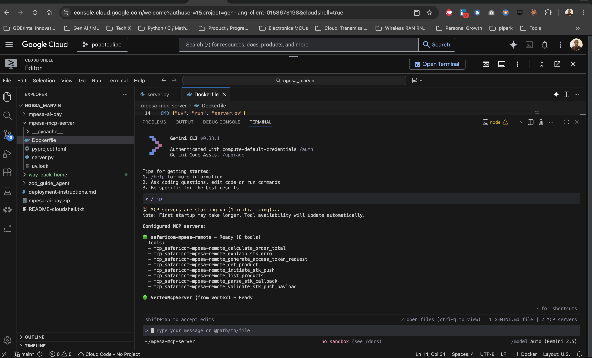

# Connect the Remote MCP Server to Gemini CLI

Now that you've successfully deployed a remote MCP server, connect to it using Gemini CLI.

## Grant Invoke Permission

Give your user account permission to call the remote MCP server:

```bash
gcloud projects add-iam-policy-binding $GOOGLE_CLOUD_PROJECT \
    --member=user:$(gcloud config get-value account) \
    --role='roles/run.invoker'
```

> **Why this is needed:** The MCP server was deployed with `--no-allow-unauthenticated`, which means only users with the `roles/run.invoker` role can call it. Without this step, your ID token will be rejected with a `403 Forbidden` error.

## Generate an ID Token

```bash
export PROJECT_NUMBER=$(gcloud projects describe $GOOGLE_CLOUD_PROJECT --format="value(projectNumber)")
export ID_TOKEN=$(gcloud auth print-identity-token)
mkdir -p ~/.gemini
```

## Create the Gemini Settings File

Create `~/.gemini/settings.json` with your MCP server configuration:

```bash
cat > ~/.gemini/settings.json << EOF
{
  "ide": {
    "hasSeenNudge": true
  },
  "mcpServers": {
    "safaricom-mpesa-remote": {
      "httpUrl": "https://safaricom-mpesa-mcp-server-${PROJECT_NUMBER}.europe-west1.run.app/mcp",
      "headers": {
        "Authorization": "Bearer ${ID_TOKEN}"
      }
    }
  },
  "security": {
    "auth": {
      "selectedType": "cloud-shell"
    }
  }
}
EOF
```

## Start Gemini CLI

```bash
gemini
```

> **Token expiry:** The ID token expires after **1 hour**. If you get authentication errors later, regenerate it:
> ```bash
> export ID_TOKEN=$(gcloud auth print-identity-token)
> ```
> Then recreate the `settings.json` file (re-run the `cat > ~/.gemini/settings.json` command above).

## Verify MCP Connection

Run:

```text
/mcp
```

You should see output similar to:

```text
Configured MCP servers:

🟢 safaricom-mpesa-remote - Ready
  Tools:
  - list_products
  - get_product
  - calculate_order_total
  - generate_access_token_request
  - validate_stk_push_payload
  - initiate_stk_push
  - parse_stk_callback
  - explain_stk_error
```




## Test the MCP Server

### Step 1: Browse the Catalog

Ask Gemini:

```text
List the products in the catalog and their prices.
```

Gemini should call the `list_products` tool and return the three workshop products with their prices.

### Step 2: Buy a Product

Now ask Gemini to buy something — **do not include your phone number**:

```text
I want to buy 1 coffee.
```

The agent should:

1. Look up the coffee price from the catalog
2. Calculate the order total
3. **Ask you for your M-PESA phone number** before initiating payment

When Gemini asks for your number, reply with your own Safaricom M-PESA registered number in `2547XXXXXXXX` format. For example:

```text
254712345678
```

> **Important:** Use your **real** Safaricom M-PESA number. You will receive an M-PESA PIN prompt on your phone. This is the sandbox — **no real money will be deducted. Any amount shown is simulated and will be automatically reversed.**

### Step 3: Complete the Payment

After you provide your phone number, the agent should:

1. Validate the STK Push payload
2. Initiate the STK Push request
3. Return a `ResponseCode: 0` confirmation

You will see the M-PESA PIN prompt appear on your phone. Enter your PIN to complete the simulated payment.

### Step 4: Verify Payment via Callback

After you enter your M-PESA PIN, Safaricom sends the transaction result to the callback URL. Open your webhook.site URL in a browser to see the callback payload:

```text
https://webhook.site/75b593ff-ae70-45a0-a569-3efe2ff58b59
```

> **Tip:** If you want your own unique callback URL, visit [webhook.site](https://webhook.site) and copy the generated URL. Replace the CallBackURL in the prompt above with yours.

You can then ask Gemini to interpret the callback:

```text
Parse this STK callback payload and tell me if the payment was successful:
```

Paste the JSON payload from webhook.site into the Gemini CLI prompt. The agent will use the `parse_stk_callback` tool to extract the receipt number, amount, and transaction status.

### Money Reversal Notice

> **For sandbox:** No real money is moved. The sandbox simulates the full flow without debiting your M-PESA wallet.
>
> **For production (Go Live):** Real money is debited from the customer's M-PESA account. If you are testing against a live short code, **any money paid during testing will be reversed**. Contact [apisupport@safaricom.co.ke](mailto:apisupport@safaricom.co.ke) if you need a reversal processed.

When you are ready to end your session, type `/quit` and press `Enter`.
