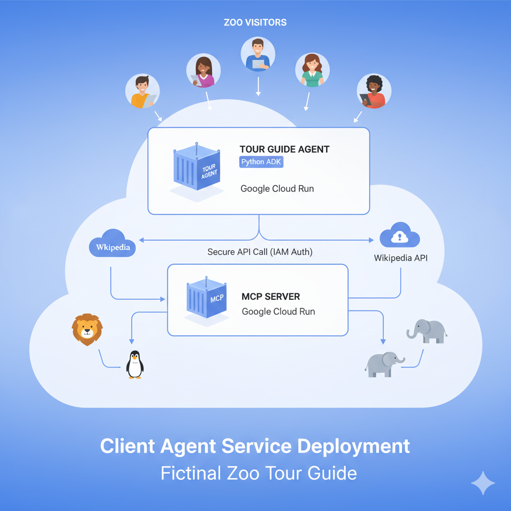

# Introduction

This lab focuses on the implementation and deployment of a client agent service. You will use **Agent Development Kit (ADK)** to build an agent with **Safaricom MCP access** that uses the MCP server created in Lab 1.

The key architectural principle remains **separation of concerns**:

- the **MCP server** owns product and payment tools
- the **ADK agent** owns orchestration, user interaction, and decision-making

## Background

In Lab 1, you created a secure MCP server that exposes:

- product catalog tools backed by static JSON
- MPESA Express tools for STK Push preparation and callback interpretation

In this lab, you will build a **Google ADK agent with Safaricom MCP access** that can:

- search products and retrieve prices
- calculate order totals
- prepare MPESA Express payment requests
- explain payment outcomes and common errors



## Architecture

```text
Google ADK Agent with Safaricom MCP Access
        |
        | HTTPS
        v
Safaricom M-PESA Express MCP Server (Lab 1)
        |
        +--> Product Catalog Tools
        |
        +--> MPESA Express Tools
```

## Prerequisites

- ✅ A running MCP server on Cloud Run from Lab 1
- ✅ A Google Cloud project with billing enabled

## What You'll Learn

- How to structure a Python project for ADK deployment
- How to implement an agent that uses `MCPToolset`
- How to connect the agent to the remote Safaricom MCP server
- How to deploy the agent to Cloud Run
- How to configure secure, service-to-service authentication using IAM roles
