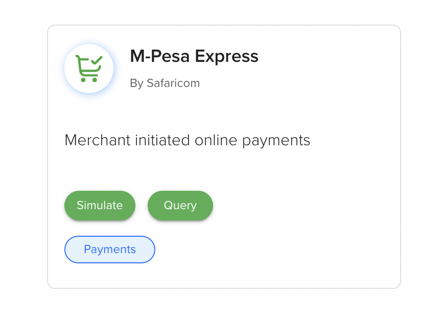

# DECODE Builders Lab: Fintech Agents with MPESA + DARAJA + ADK on Cloud Run

Welcome! This Builders Lab is a hands-on, intermediate-to-expert fintech session focused on integrating **Safaricom DECODE / DARAJA APIs** with **Google Cloud** agent infrastructure.

## Event Details

- **Day:** Day 2
- **Date:** **1st April**
- **Session:** Builders Lab
- **Time:** **2:00 PM - 5:00 PM**
- **Theme:** **Fintech**
- **Audience:** Curated intermediate and expert developers
- **Expected Capacity:** 400 builders

## Session Focus

Integrating Safaricom and Google technologies:

- **Safaricom DECODE + DARAJA APIs**
- **Google Cloud Run**
- **Vertex AI**
- **Google ADK (Agent Development Kit)**
- **Agents + MCP**
- **Apigee** *(optional extension)*

---

## Learning Tracks

### Track B: Deploy a Secure MPESA + DARAJA APIs MCP Server on Cloud Run

You will:

- Deploy an **MPESA + DARAJA APIs MCP server** to Cloud Run.  // Apijee (MCP server) - 




M-Pesa Express
By Safaricom
Merchant initiated online payments

5 min 

Convert the Daraja APIs to MCP tools ...

- Secure the server endpoint by requiring authentication for all requests.
- Ensure only authorized clients and agents can call the service.
- Connect to the secure MCP endpoint from **Gemini CLI**.

### Track C: Build and Deploy an ADK + MPESA + DARAJA Agent on Cloud Run

You will:

- Structure a Python project for **ADK** deployment.
- Implement a tool-using agent with **google-adk**.
- Deploy the Python service as a serverless container on **Cloud Run**.
- Configure secure service-to-service authentication with **IAM roles**.
- Clean up Cloud resources to avoid future costs.

D -- Make the solution discoverable on Agentic Marketplace 

E -- loggin hours into jira

---

## Core Platforms and References

- [Safaricom DECODE](https://decode.safaricom.co.ke/)
- [Safaricom DARAJA APIs](https://daraja.safaricom.co.ke/)
- [BuildWithAI reference repo](https://github.com/ngesa254/labsdotgde/tree/main/BuildWithAI)
- [ADK workshop reference](https://github.com/wietsevenema/adk-workshop)

---

## Suggested Lab Flow (2-5 PM)

| Time (EAT) | Segment | Outcome |
|-----------|---------|---------|
| 2:00-2:20 | Context + architecture briefing | Shared understanding of MCP + ADK + DARAJA architecture |
| 2:20-3:05 | **Track B** hands-on | Secure MCP server deployed on Cloud Run |
| 3:05-3:15 | Break + troubleshooting | Resolve IAM/auth issues |
| 3:15-4:25 | **Track C** hands-on | ADK agent deployed and connected to MCP tools |
| 4:25-4:45 | Validation + demos | End-to-end tool calls and agent behavior verified |
| 4:45-5:00 | Cleanup + wrap-up | Cost-safe teardown complete |

---

## Architecture (Target)

```text
Developer / Gemini CLI
        |
        | Authenticated MCP calls (ID token)
        v
Cloud Run: MPESA + DARAJA MCP Server
        |
        | Tool wrappers for DARAJA endpoints
        v
Safaricom DARAJA APIs

Cloud Run: ADK Agent Service
        |
        | IAM-authenticated service-to-service MCP access
        v
Cloud Run: MPESA + DARAJA MCP Server
```

---

## Prerequisites

- Google Cloud project with billing enabled
- Access to Cloud Shell or local gcloud environment
- Python 3.11+ and package manager (`uv` or `pip`)
- Gemini CLI installed and authenticated
- Safaricom DARAJA developer credentials/app setup
- Intermediate familiarity with Python, APIs, IAM, and Cloud Run

---

## Lab Outcomes

By the end of this session, participants should have:

- A deployed and secure MCP server exposing MPESA/DARAJA tools
- A deployed ADK agent that calls MCP tools over authenticated channels
- Working IAM bindings for least-privilege service invocation
- A tested Gemini CLI workflow against the secure endpoint
- A cleanup checklist executed to avoid ongoing costs

---

## Cleanup Checklist (Mandatory)

To avoid future charges, remove resources after the lab:

- Delete Cloud Run services (MCP server + ADK agent)
- Delete Artifact Registry repositories created for source deployments
- Delete unneeded service accounts and IAM bindings
- Delete the project if this was lab-only
- Remove local env files that include credentials/secrets

---

## Next Extensions (Optional)

- Add **Apigee** as an API security and governance layer
- Introduce observability (structured logs + traces)
- Add rate limiting and quota guards for production readiness
- Expand agent toolset with additional fintech workflows

---

**Happy building. Ship secure fintech agents.**
