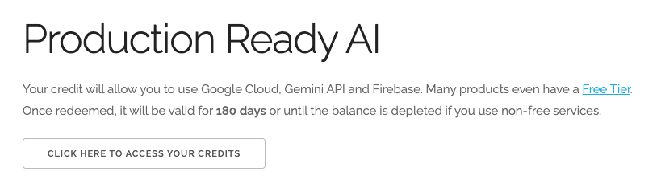
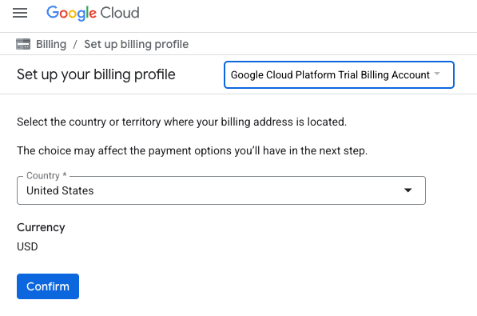
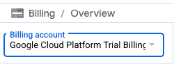

# Project Setup

## Google Account

If you don't already have a personal Google Account, you must create a Google Account.

> **Important:** Use a personal account instead of a work or school account. Work and school accounts may have restrictions that prevent you from enabling the APIs needed for this lab.

## Sign-in to the Google Cloud Console

Sign-in to the [Google Cloud Console](https://console.cloud.google.com) using a personal Google account.

## Enable Billing

### Redeem $5 Google Cloud Credits (Optional)

To run this workshop, you need a Billing Account with some credit. If you are planning to use your own billing, you can skip this step.

1. Click [this link](https://www.cloudskillsboost.google/focuses/[LINK]) and sign in with a personal Google account. You will see something like this:

2. Click the **CLICK HERE TO ACCESS YOUR CREDITS** button. This will bring you to a page to set up your billing profile.

3. Click **Confirm**.

You are now connected to a Google Cloud Platform Trial Billing Account.

### Set up a Personal Billing Account

If you set up billing using Google Cloud credits, you can skip this step.

To set up a personal billing account, go [here](https://console.cloud.google.com/billing) to enable billing in the Cloud Console.

#### Some Notes:

- Completing this lab should cost less than **$1 USD** in Cloud resources.
- You can follow the steps at the end of this lab to delete resources to avoid further charges.
- New users are eligible for the [**$300 USD Free Trial**](https://cloud.google.com/free).

## Create a Project (Optional)

If you do not have a current project you'd like to use for this lab, [create a new project here](https://console.cloud.google.com/projectcreate).

---

**Next Steps:** Once you have completed the project setup, you can proceed with the lab exercises.