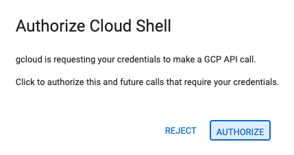
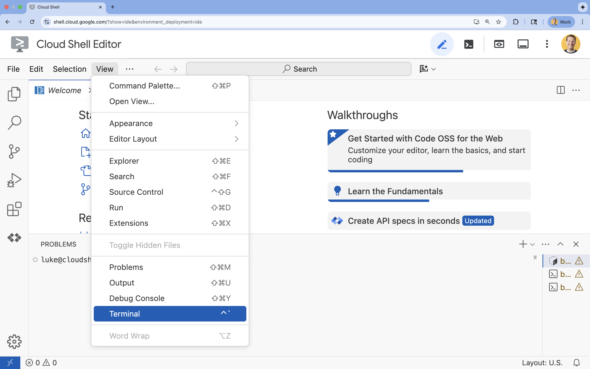
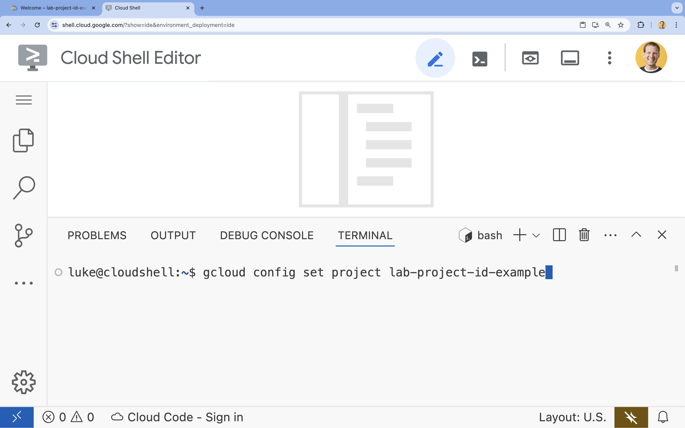

# Open Cloud Shell Editor

## Setup Instructions

1. Click [this link](https://shell.cloud.google.com/?show=ide%2Cterminal) to navigate directly to Cloud Shell Editor.

2. If prompted to authorize at any point today, click **Authorize** to continue.



3. If the terminal doesn't appear at the bottom of the screen, open it:
   - Click **View**
   - Click **Terminal**

   

4. In the terminal, set your project with this command:

   ```shell
   gcloud config set project [PROJECT_ID]
   ```

   **Example:**

   ```shell
   gcloud config set project lab-project-id-example
   ```

   **If you can't remember your project ID**, you can list all your project IDs with:

   ```shell
   gcloud projects list | awk '/PROJECT_ID/{print $2}'
   ```



5. You should see this message:

   ```
   Updated property [core/project].
   ```

---

> **⚠️ Warning**  
> If you see a `WARNING` and are asked `Do you want to continue (Y/n)?`, then you have likely entered the project ID incorrectly. Press `n`, press `Enter`, and try to run the `gcloud config set project` command again.

---

**Next Steps:** Once your project is configured, you're ready to begin working with the Cloud Shell Editor.