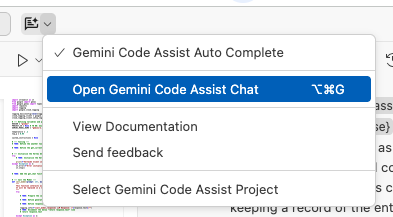
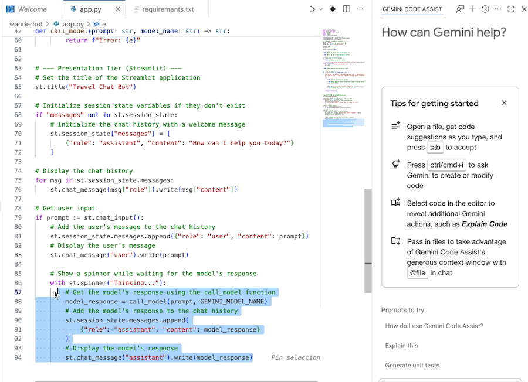

# Explore the Code

## Understanding Your Starter Files

The files you created include a basic chat application frontend. They include:

### `app.py`

This is the file we will be working in. It currently contains the following:

- **Necessary imports** - Libraries required for the application
- **Environment variables and parameters** - Some of which are placeholders that you'll fill in
- **An empty `call_model` function** - Which we'll be filling in throughout the lab
- **Streamlit code** - For the front-end chat app interface

### `requirements.txt`

- Includes the installation requirements for running `app.py`

---

## Now, Time to Explore the Code!

### Open Gemini Code Assist Chat

The Gemini Code Assist Chat should already be open in a panel on the right in the Cloud Shell Editor. 

If the Gemini Code Assist Chat is not already open, you can open it with the following steps:

1. Click the **Gemini Code Assist button** (✨) near the top of the screen.

2. Select **Open Gemini Code Assist Chat**.

### Use Gemini Code Assist to Understand the Code

You can use Gemini Code Assist Chat to better understand the code.

**Steps:**

1. **Highlight or select** the desired code section in `app.py`.

2. Type **"Explain this code"** in the Gemini chat.

3. Click **Enter** to submit.

---

> **💡 Tip**  
> Gemini Code Assist can help you understand complex code sections, explain functions, and provide insights into how different parts of the application work together. Use it freely throughout the lab!

---

**Next Steps:** With a better understanding of the starter code structure, you're ready to begin implementing the chatbot functionality.