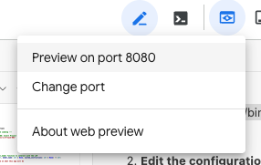

# Launch the Webapp

## Overview

Before connecting this app to an LLM, launch it to see how it behaves initially.

## Launch Instructions

### 1. Start the Streamlit Application

From within the `wanderbot` directory, run the following command in the terminal to start the Streamlit application and make it locally accessible within your Cloud Shell environment:

```shell
streamlit run app.py --browser.serverAddress=localhost --server.enableCORS=false --server.enableXsrfProtection=false --server.port 8080
```

> **📌 Important**  
> Keep this terminal window open, as the Streamlit application will continue to run. You can open a new terminal window in Cloud Shell to run other commands.

> **⚠️ Note**  
> If you get the error "Port 8080 is already in use", you can change the port number in the above code to a different number, and select 'Change port' to switch ports.

### 2. Open the Web Preview

After running the command, click the **Web Preview** button at the top of the Cloud Shell editor and select **Preview on port 8080**. 

You will see a simple chat interface for your travel app.



### 3. Test the Application

Type any message (e.g., `Hi!`) and press **ENTER**. 

You will notice that the message will appear in the chat history, but you will receive an error message rather than a response from the assistant. 

**This is expected behavior!** This is because the application is not yet connected to a large language model. Observe this behavior to understand the starting point of the lab.

---

## What You Should See

- ✅ A chat interface with the title "Travel Chat Bot"
- ✅ Your messages appearing in the chat history
- ❌ Error messages instead of AI responses (because the LLM is not yet connected)

---

**Next Steps:** In the following steps, you'll connect the application to the Gemini model using the Vertex AI SDK to enable AI-powered responses.